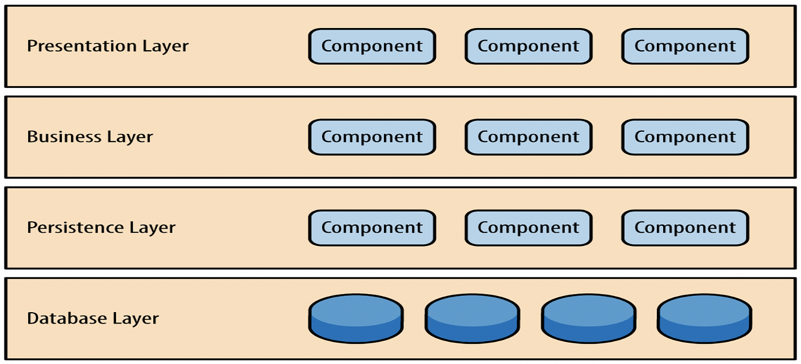

# Proyecto APIRest Express

## Estructura base

> este proyecto esta separado en capas (router,controller,service,model)

* **router**:...

* **contreller**: ...

### Patrones



---

## Proyecto complemetario a Frontend React

[Frontend React](https://github.com/Salocin0/ecommerce-react)

---

## Autores

1. user 1
2. user 2
3. user 3

## CORS

```js

const corsOptions = {
    origin: ["http://localhost:5173"],
    methods:["GET","PUT","POST","DELETE"], //no bloquea directamente sino que es lo que responde al tirar el options
    allowedHeaders: ["Content-Type"]
}
```

> se permite unicamente las peticiones del front

> se requiere que tengan el header Content-Type

>[!WARNING]
>Es Necesario crear un .env con las siguientes configuraciones

```js
PORT=
MONGOURL=
MONGOURLEXT=
```
asdasd